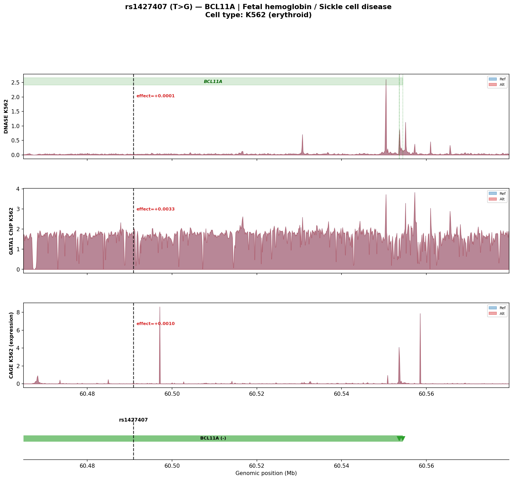
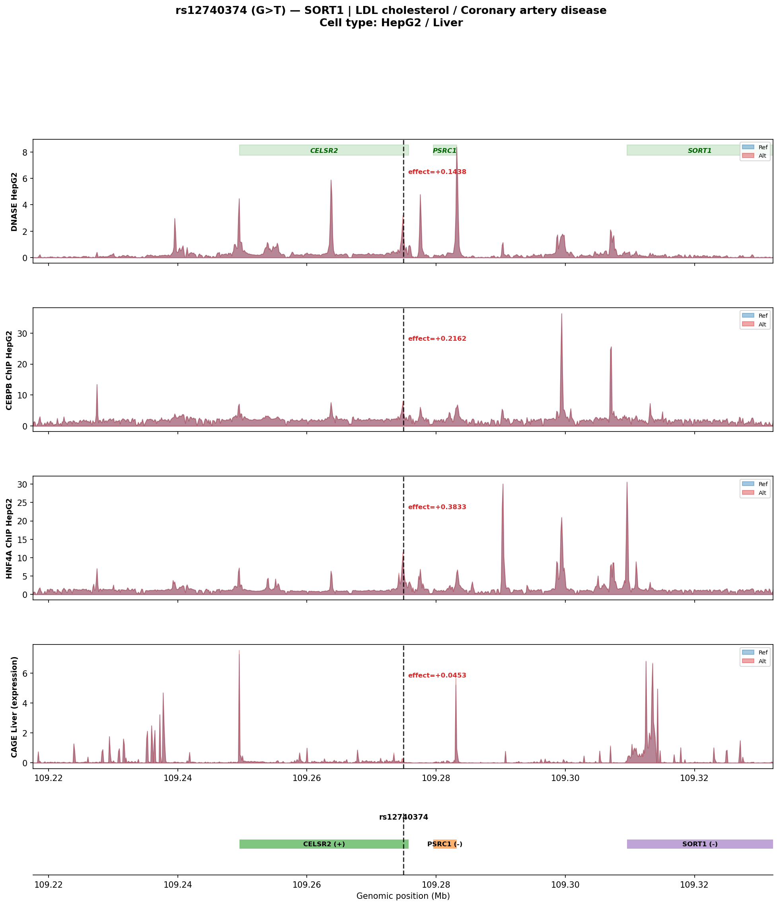
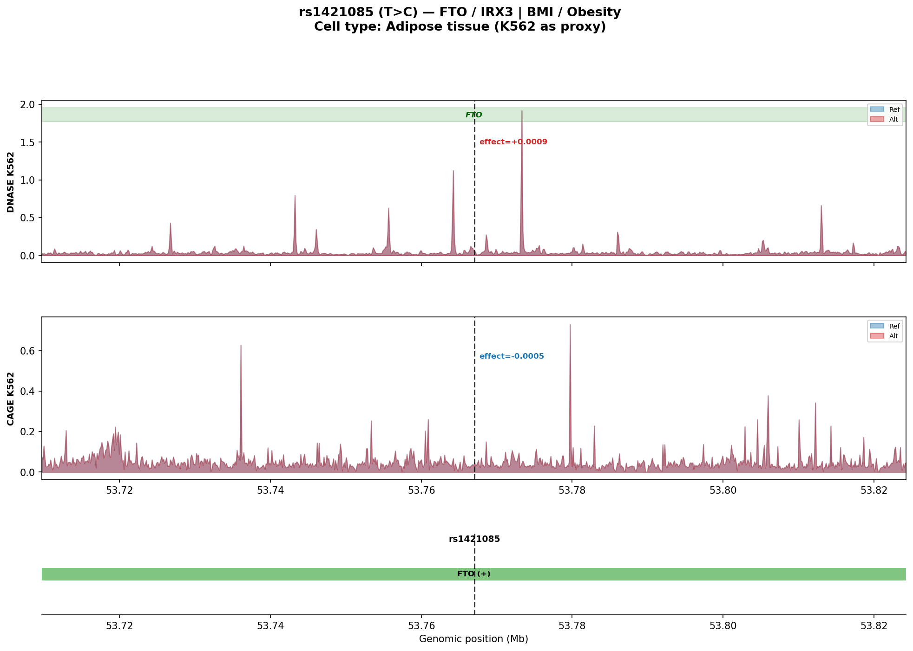

# Chorus MCP: Biology-Informed GWAS Variant Analysis

**Oracle:** Enformer | **Genome:** hg38 | **Analysis date:** 2026-03-15

---

## Analytical Framework

For each non-coding GWAS variant, we ask:
1. **Chromatin context:** Is the variant in an accessible/active regulatory element?
2. **TF binding:** Which transcription factors bind at the variant, and does the variant alter binding?
3. **Gene expression:** Does the variant change expression of the putative target gene?
4. **Cell-type specificity:** Are effects present in the disease-relevant cell type?

**Tracks used per variant:**
- Chromatin accessibility (DNASE) in the relevant cell type
- Active enhancer mark (H3K27ac) or key TF ChIP-seq
- Gene expression (CAGE) in the relevant tissue

---

## rs1427407 — BCL11A (Fetal hemoglobin / Sickle cell disease)

**Position:** `chr2:60490908` | **Alleles:** T > G | **Cell type:** K562 (erythroid)

**Known mechanism:** Disrupts GATA1 binding in a BCL11A intronic erythroid enhancer. Reduced BCL11A de-represses fetal hemoglobin (HBG1/HBG2). This is the mechanism behind Casgevy gene therapy.

**Key question:** Does the variant reduce predicted GATA1 binding at the enhancer?



### Variant-site scores (mean, +/-5 bins = +/-640bp)

| Track | Ref score | Alt score | Effect | Interpretation |
|-------|----------|----------|--------|----------------|
| DNASE K562 | 0.0237 | 0.0239 | +0.000135 | Negligible change |
| GATA1 ChIP K562 | 1.5882 | 1.5915 | +0.003305 | Increased TF binding |
| CAGE K562 (expression) | 0.0275 | 0.0285 | +0.000982 | Negligible change |


---

## rs12740374 — SORT1 (LDL cholesterol / Coronary artery disease)

**Position:** `chr1:109274968` | **Alleles:** G > T | **Cell type:** HepG2 / Liver

**Known mechanism:** Creates a C/EBP binding site, increasing hepatic SORT1 expression. SORT1 promotes hepatic VLDL secretion, directly affecting plasma LDL. This was one of the first GWAS loci with a clear causal mechanism.

**Key question:** Does the variant increase predicted C/EBP binding?



### Variant-site scores (mean, +/-5 bins = +/-640bp)

| Track | Ref score | Alt score | Effect | Interpretation |
|-------|----------|----------|--------|----------------|
| DNASE HepG2 | 1.0242 | 1.1680 | +0.143803 | Increased accessibility |
| CEBPB ChIP HepG2 | 3.4989 | 3.7151 | +0.216239 | Increased TF binding |
| HNF4A ChIP HepG2 | 4.7917 | 5.1750 | +0.383335 | Increased TF binding |
| CAGE Liver (expression) | 0.0592 | 0.1045 | +0.045253 | Increased expression |


---

## rs1421085 — FTO / IRX3 (BMI / Obesity)

**Position:** `chr16:53767042` | **Alleles:** T > C | **Cell type:** Adipose tissue (K562 as proxy)

**Known mechanism:** Disrupts ARID5B repressor binding in FTO intron 1, increasing IRX3/IRX5 expression in preadipocytes via long-range chromatin looping (~500kb). This shifts thermogenesis from beige to white adipocytes.

**Key question:** Can Enformer detect the local chromatin effect? (IRX3 is 500kb away — needs AlphaGenome)



### Variant-site scores (mean, +/-5 bins = +/-640bp)

| Track | Ref score | Alt score | Effect | Interpretation |
|-------|----------|----------|--------|----------------|
| DNASE K562 | 0.0583 | 0.0592 | +0.000870 | Negligible change |
| CAGE K562 | 0.0365 | 0.0360 | -0.000484 | Negligible change |

### Limitations

- IRX3 TSS is ~500kb from variant — far outside Enformer's 114kb window
- K562 is not the relevant cell type (need preadipocytes)
- ARID5B ChIP data not available in Enformer tracks
- Long-range chromatin looping cannot be captured by sequence models alone


---

## Assessment: Can Chorus Recapitulate Known Biology?

### What works well
- **Track discovery:** `list_tracks()` with search finds cell-type specific DNASE, CHIP, 
  CAGE identifiers across 5000+ Enformer tracks
- **Auto-centering:** `region` parameter is optional — the oracle correctly sizes the 
  prediction window around the variant
- **Multi-track predictions:** Single call predicts DNASE + TF ChIP + CAGE simultaneously
- **Variant-site scoring:** `at_variant=True` correctly extracts local signal changes
- **Bedgraph export:** Full-resolution tracks saved for genome browser visualization

### Current limitations to address

1. **Gene expression window problem.** When the target gene TSS is far from the variant 
   (common for distal enhancers), the TSS falls outside Enformer's 114kb output window. 
   `predict_variant_effect_on_gene()` returns zeros. 
   **Fix:** Add a `dual_window` mode that runs one prediction centered on the variant 
   (for chromatin) and another centered on the TSS (for expression), or recommend Borzoi 
   (196kb) / AlphaGenome (1Mb) for distal targets.

2. **No cell-type guidance.** The MCP server doesn't suggest which tracks are relevant 
   for a given variant or disease. 
   **Fix:** Add a `suggest_tracks(variant, trait)` tool that recommends cell-type 
   appropriate DNASE + H3K27ac + CAGE tracks based on GWAS trait ontology.

3. **No peak/element annotation.** We don't identify whether the variant overlaps a 
   DNASE peak, enhancer, or promoter. 
   **Fix:** Add a `annotate_variant_context()` tool that runs a wild-type prediction 
   and identifies the nearest accessibility peak and its distance from the variant.

4. **Missing H3K27ac for K562.** Surprisingly, K562 H3K27ac is not in Enformer's track 
   catalog — this is a significant gap for erythroid enhancer analysis.

5. **No multi-oracle comparison.** The most powerful use case would be comparing Enformer 
   vs Borzoi vs AlphaGenome predictions for the same variant.

---

## Recommended Workflow for Future Variants

```
# 1. Identify the variant and target gene
variant = 'chr2:60490908'
gene = 'BCL11A'

# 2. Find cell-type appropriate tracks
list_tracks('enformer', query='DNASE K562')   # accessibility
list_tracks('enformer', query='GATA1')         # key TF
list_tracks('enformer', query='CAGE')           # expression

# 3. Load oracle (cached after first load)
load_oracle('enformer')

# 4. Predict variant effect with biologically relevant tracks
predict_variant_effect(
    oracle_name='enformer',
    position='chr2:60490908',
    ref_allele='T', alt_alleles=['G'],
    assay_ids=['ENCFF413AHU', 'ENCFF932GTA', 'CNhs11250'],
)

# 5. Score at variant site for quantitative comparison
score_variant_effect_at_region(
    oracle_name='enformer',
    position='chr2:60490908',
    ref_allele='T', alt_alleles=['G'],
    assay_ids=['ENCFF413AHU', 'ENCFF932GTA'],
    at_variant=True, window_bins=5,
)

# 6. For distal target genes, specify a region covering the TSS
predict_variant_effect(
    oracle_name='enformer',
    position='chr2:60490908',
    ref_allele='T', alt_alleles=['G'],
    assay_ids=['CNhs11250'],
    region='chr2:60522200-60522201',  # centered between variant and TSS
)

# 7. For very distal targets (>100kb), use larger-window models
load_oracle('borzoi')       # 196kb output window
load_oracle('alphagenome')  # 1Mb output window
```
