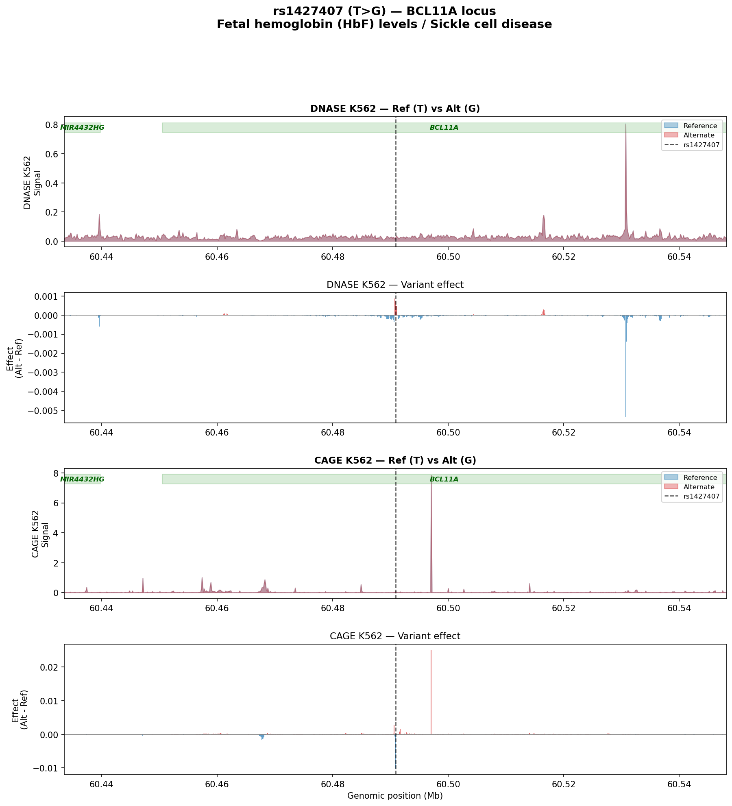
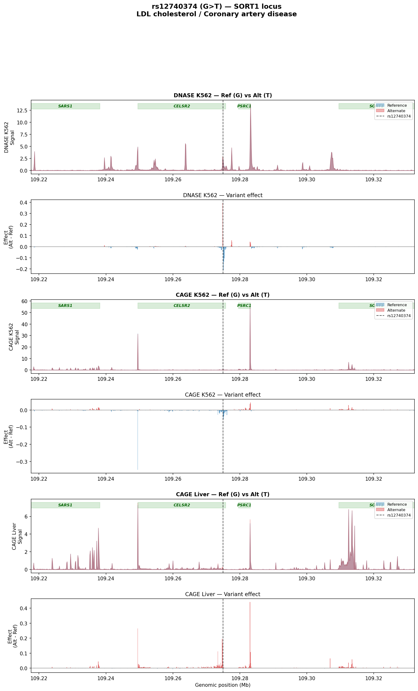
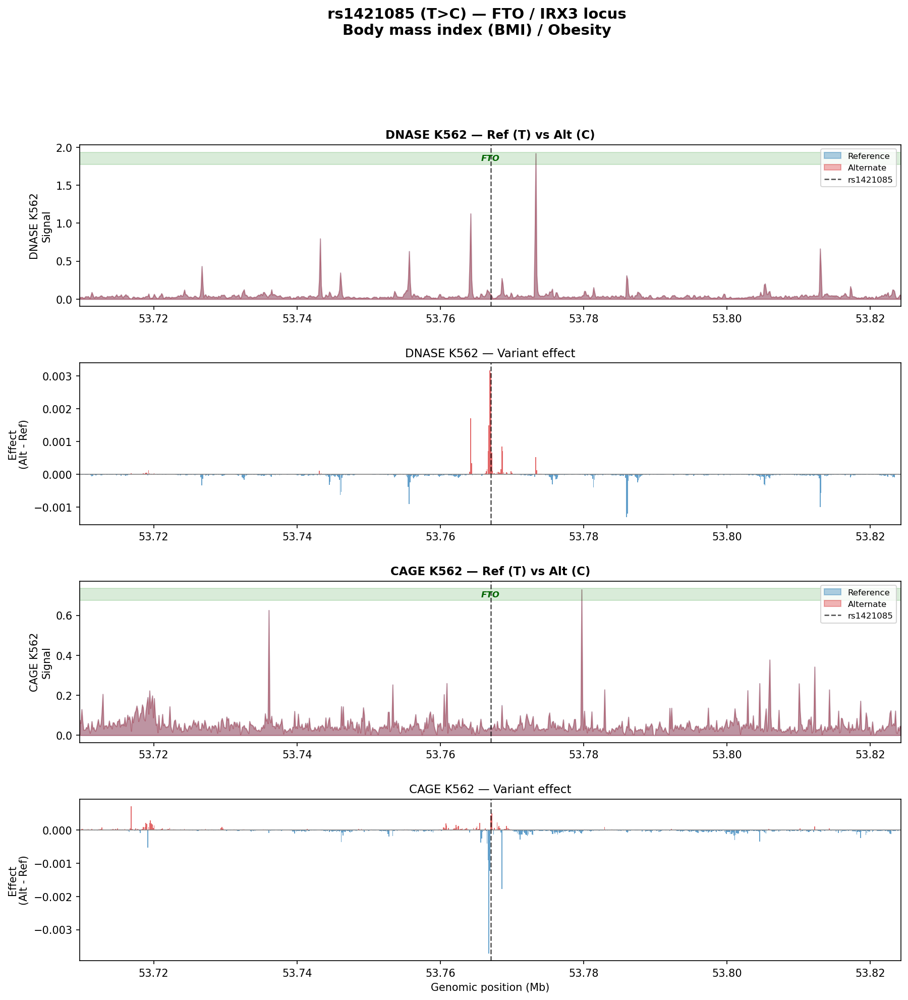

# Chorus MCP: GWAS Variant Effect Analysis Report

**Oracle:** Enformer (DeepMind) | **Genome:** hg38 | **Generated by:** Chorus MCP Server

---

## Overview

This report demonstrates end-to-end variant effect prediction using the Chorus MCP server 
with Enformer on 3 canonical GWAS variants that have well-characterized molecular mechanisms.

---

## rs1427407 — BCL11A (Fetal hemoglobin (HbF) levels / Sickle cell disease)

**Position:** `chr2:60490908` | **Alleles:** T > G

**Biological mechanism:** Located in a BCL11A intronic erythroid enhancer, this variant disrupts GATA1 binding and reduces BCL11A expression, de-repressing fetal hemoglobin. This mechanism is the basis for sickle cell gene therapies (Casgevy).

### Enformer Predictions



| Track | Mean Effect | Abs Max Effect | Peak Position | Std |
|-------|-----------|---------------|---------------|-----|
| DNASE K562 | -0.000034 | 0.005333 | `chr2:60530717` | 0.000195 |
| CAGE K562 | 0.000029 | 0.025076 | `chr2:60497053` | 0.000920 |


---

## rs12740374 — SORT1 (LDL cholesterol / Coronary artery disease)

**Position:** `chr1:109274968` | **Alleles:** G > T

**Biological mechanism:** Creates a C/EBP binding site in the CELSR2-PSRC1-SORT1 locus, increasing hepatic SORT1 expression. SORT1 promotes VLDL secretion from hepatocytes, directly linking this variant to plasma LDL levels.

### Enformer Predictions



| Track | Mean Effect | Abs Max Effect | Peak Position | Std |
|-------|-----------|---------------|---------------|-----|
| DNASE K562 | -0.000522 | 0.392955 | `chr1:109274841` | 0.016928 |
| CAGE K562 | -0.000946 | 0.348381 | `chr1:109249497` | 0.012489 |
| CAGE Liver | 0.003335 | 0.440748 | `chr1:109283033` | 0.020491 |


---

## rs1421085 — FTO / IRX3 (Body mass index (BMI) / Obesity)

**Position:** `chr16:53767042` | **Alleles:** T > C

**Biological mechanism:** Despite residing in FTO intron 1, this variant disrupts an ARID5B repressor binding site, leading to increased IRX3/IRX5 expression in adipocyte precursors. This shifts the thermogenic program from energy-dissipating beige adipocytes to energy-storing white adipocytes.

### Enformer Predictions



| Track | Mean Effect | Abs Max Effect | Peak Position | Std |
|-------|-----------|---------------|---------------|-----|
| DNASE K562 | -0.000016 | 0.003169 | `chr16:53766915` | 0.000199 |
| CAGE K562 | -0.000026 | 0.003714 | `chr16:53766787` | 0.000160 |


---

## How to Run Your Own Variant Analysis

The Chorus MCP server makes it easy to analyze any variant of interest. Here is a 
step-by-step workflow:

### 1. Discover available tracks
```
list_tracks("enformer", query="DNASE")
list_tracks("enformer", query="CAGE")
```
This returns track identifiers (e.g., `ENCFF413AHU` for DNASE:K562) that you'll use in predictions.

### 2. Load an oracle
```
load_oracle("enformer")  # ~10s, cached for reuse
```
Other oracles: `borzoi` (32bp resolution), `alphagenome` (1bp resolution, 1Mb window), 
`chrombpnet` (base-resolution TF binding).

### 3. Predict variant effect
```
predict_variant_effect(
    oracle_name="enformer",
    position="chr2:60490908",     # variant position
    ref_allele="T",
    alt_alleles=["G"],
    assay_ids=["ENCFF413AHU", "CNhs11250"],
    # region is auto-centered on the variant
)
```
Returns per-track summary stats and saves bedgraph files for genome browser viewing.

### 4. Score at the variant site
```
score_variant_effect_at_region(
    oracle_name="enformer",
    position="chr2:60490908",
    ref_allele="T", alt_alleles=["G"],
    assay_ids=["ENCFF413AHU"],
    at_variant=True,
    window_bins=5,  # +/- 5 bins (640bp) around variant
    scoring_strategy="mean",
)
```

### 5. Assess impact on gene expression
```
predict_variant_effect_on_gene(
    oracle_name="enformer",
    position="chr2:60490908",
    ref_allele="T", alt_alleles=["G"],
    gene_name="BCL11A",
    assay_ids=["CNhs11250"],  # CAGE track for expression
)
```
Returns fold change, log2FC, and absolute change in predicted expression.

### Tips
- **Multi-oracle comparison:** Load multiple oracles and compare predictions across models.
- **Cell-type specificity:** Use tissue-relevant tracks (e.g., liver CAGE for lipid variants, 
  erythroid tracks for hemoglobin variants).
- **ChromBPNet for TF binding:** Use `chrombpnet` with specific TFs to predict binding changes 
  at base resolution.
- **Region parameter is optional:** When omitted, the region is auto-centered on the variant, 
  correctly sized for each oracle's output window.
